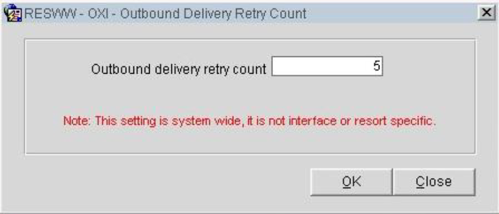

# Configuración de Reintento de Entrega

Esta sección permite configurar un valor de reintento definido por el usuario para los mensajes que no se envían correctamente debido a la indisponibilidad del servidor.

## Notas Importantes
- **Alcance**: Esta configuración no es específica de una interfaz o propiedad. El valor de reintento definido afectará a todas las interfaces OXI dentro del mismo esquema OXI.
- **Valor Recomendado**: El valor debe establecerse en **5**.

## Configuración
1. Accede a la opción **RESWW - OXI - Outbound Delivery Retry Count**.
2. Establece el valor **Outbound delivery retry count** en **5**.

## Consideraciones
- **Impacto Global**: Esta configuración es aplicable a todo el sistema y no está limitada a una interfaz o resort específico.

## Ejemplo de Configuración

## Pasos Finales
- Haz clic en **OK** para guardar la configuración.
- Cierra la ventana para completar el proceso.
