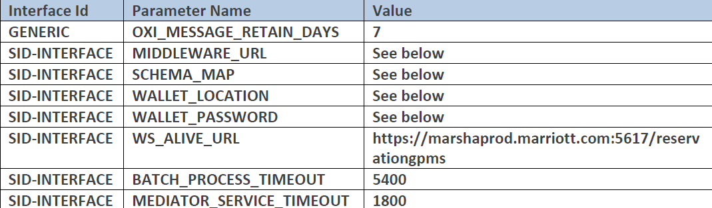

OPO Properties
For hotels below OPERA v5.6.15.17 the MIDDLEWARE_URL, SCHEMA_MAP, WALLET_LOCATION, and WALLET_PASSWORD should not be used from Global Parameters.
These values are defined for each OXI in their respective Interface Parameters section.

## Ejemplo Configuracion

 - NOTE: MIDDLEWARE_URL MUST BE updated so that [HOSTNAME] matches the hostname of the server Example: if the hostname is HDQRKVMOPRSS then the MW BASE URL would be http://HDQRKVMOPRSS:80
 - NOTE: MIDDLEWARE_URL CANNOT be the IP address
 - NOTE: MIDDLEWARE_URL CANNOT be the OPERA URL
 - NOTE: WALLET_PASSWORD is your OPERA Unified Password

APO Properties
For hotels below OPERA v5.6.15.17 the MIDDLEWARE_URL, SCHEMA_MAP, WALLET_LOCATION, and WALLET_PASSWORD should not be used from Global Parameters.
These values are defined for each OXI in their respective Interface Parameters section.

CAUTION: MIDDLEWARE_URL & SCEMA_MAP must be populated correctly prior to activation of resort. Failure to configure with valid information may cause the Marsha interface to stop functioning. Confirm appropriate value with the project team (confirmed via AMS).
- NOTE: SCHEMA_MAP for APO hotels at Oracle datacenters should be opera
- NOTE: WALLET_LOCATION & WALLET_PASSWORD For Above Property OPERA the location and password are obtained from the Oracle Consulting Leads
